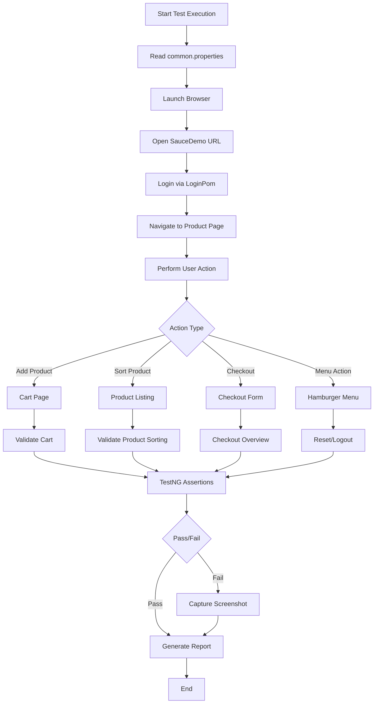
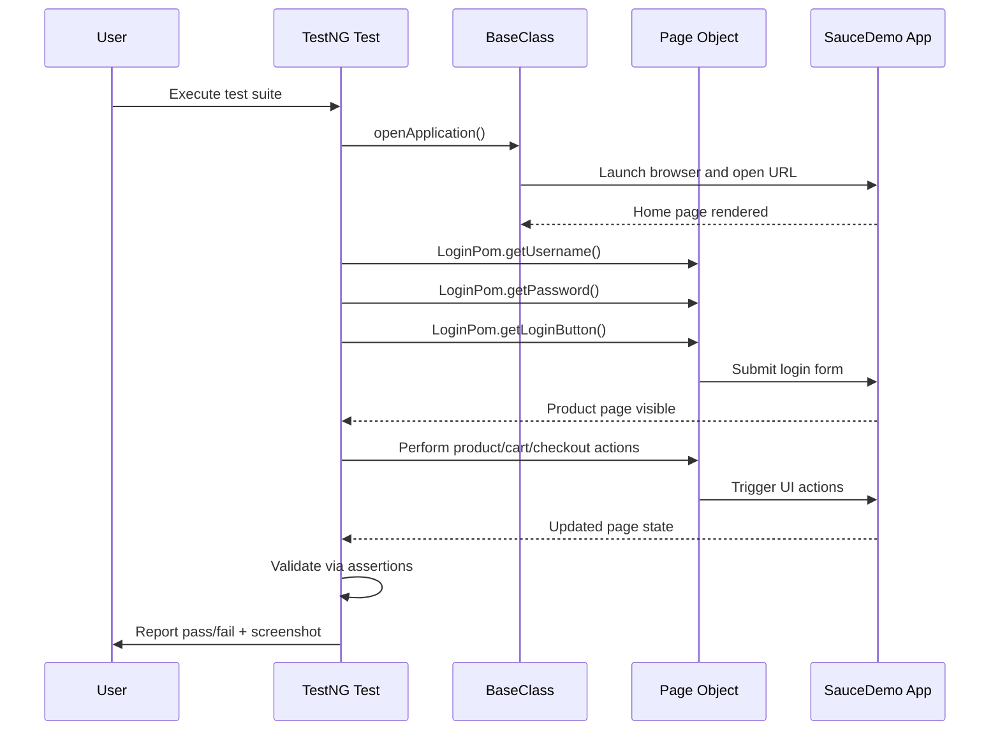
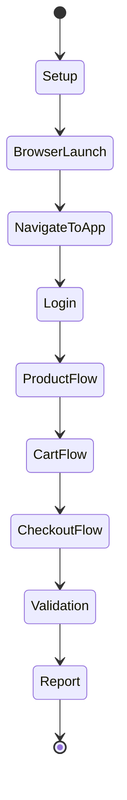
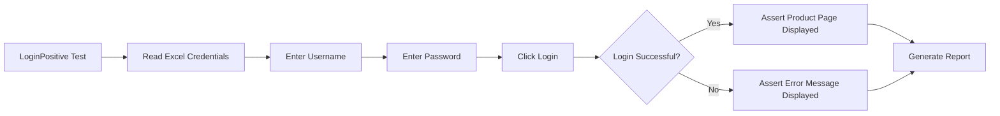

# Capgemini Sprint - Selenium Test Automation Project

A Java-based Selenium TestNG automation project designed for end-to-end validation of the Sauce Demo e-commerce application. The project follows a Page Object Model (POM) structure and covers login, product, cart, checkout, hamburger menu, and negative test scenarios.

## Project Overview

This repository is built for automated UI testing of the Sauce Demo website using:
- Java
- Selenium WebDriver
- TestNG
- Apache POI
- Maven
- Log4j

The automation suite validates core user journeys and verifies that application behavior remains stable across positive, negative, smoke, regression, integration, system, and boundary value scenarios.

## Business Scope

The project simulates real user interactions on the Sauce Demo application, including:
- User login and logout
- Product listing and sorting
- Add-to-cart workflow
- Cart page validation
- Checkout information flow
- Order completion flow
- Hamburger menu actions
- Reset app state
- Invalid input validation

## Tech Stack

- Java 25 (configured in `pom.xml`)
- Maven for dependency management and test execution
- Selenium Java 4.46.0
- TestNG 7.12.0
- Apache POI 5.4.1 for Excel-based test data
- Log4j Core 2.25.2
- JSON-Simple 1.1.1

## Project Structure

```text
Capgemini-Sprint/
├── src/
│   ├── main/
│   │   ├── java/
│   │   │   ├── BaseClassUtility/
│   │   │   │   └── BaseClass.java
│   │   │   ├── GenericUtility/
│   │   │   │   ├── ExcelUtility.java
│   │   │   │   └── TakingScreenShot.java
│   │   │   └── PomClassUtilities/
│   │   │       ├── LoginPom.java
│   │   │       ├── ProductPom.java
│   │   │       ├── CartPom.java
│   │   │       ├── CheckOutPom.java
│   │   │       ├── OverviewPom.java
│   │   │       ├── CompletePagePom.java
│   │   │       └── HamburgerPom.java
│   │   └── resources/
│   │       └── DDT/
│   │           └── common.properties
│   └── test/
│       ├── java/
│       │   ├── LoginScript/
│       │   │   ├── LoginPositive.java
│       │   │   ├── LoginNegative.java
│       │   │   └── LogoutScript.java
│       │   ├── ProductScript/
│       │   │   └── ProductPositive.java
│       │   ├── CartScript/
│       │   │   ├── CartPositive.java
│       │   │   └── CartNegative.java
│       │   ├── CheckoutScript/
│       │   │   ├── CheckoutPositive.java
│       │   │   └── CheckoutNegative.java
│       │   ├── HamburgerScript/
│       │   │   └── HamburgerPositive.java
│       │   └── ...
│       └── resources/
│           └── SauceDemoCreds.xlsx
├── pom.xml
├── testng-Bva.xml
├── testng-Functionality.xml
├── testng-Integration.xml
├── testng-Negative.xml
├── testng-Parallel-Execution.xml
├── testng-Regression.xml
├── testng-Smoke.xml
├── testng-System.xml
├── testng-cross-browser.xml
├── Screenshots/
├── target/
├── .gitignore
├── imp.txt
└── README.md
```

## Core Architecture

### 1. Base Class
The `BaseClass` class handles browser startup and teardown for each test method.

Responsibilities:
- Reads browser and URL from `common.properties`
- Launches Chrome, Edge, or Firefox
- Maximizes the browser window
- Opens the Sauce Demo application
- Handles login for reusable test flows
- Closes the browser after every test

### 2. Page Object Model
Each page of the application is represented by a dedicated Java class under `PomClassUtilities`.

Examples:
- `LoginPom` - login form and validation
- `ProductPom` - product listing, sort, and cart actions
- `CartPom` - cart actions such as remove, continue, and checkout
- `CheckOutPom` - checkout form entry
- `OverviewPom` - checkout overview verification
- `CompletePagePom` - order confirmation page
- `HamburgerPom` - side menu actions

This design keeps the test logic clean, maintainable, and reusable.

### 3. Test Data Handling
The project uses Excel files via Apache POI to drive test cases. Data is loaded from:
- `src/test/resources/SauceDemoCreds.xlsx`

Test data is used for:
- Valid login credentials
- Negative login combinations
- Checkout form values

### 4. Reporting and Screenshots
The project uses TestNG reporting and custom screenshot utility to capture failures for easier debugging.

## Configuration

Application configuration is stored in:

`src/main/resources/DDT/common.properties`

Example:
```properties
browser=chrome
url=https://www.saucedemo.com/
username=standard_user
```

### Supported Browsers
The framework supports:
- Chrome
- Edge
- Firefox

The browser is selected from the properties file.

## Test Suites and Coverage

The repository contains several TestNG suite files for different execution types:

- `testng-Smoke.xml` - smoke scenarios
- `testng-Functionality.xml` - functional validations
- `testng-Integration.xml` - flow integration checks
- `testng-Negative.xml` - invalid input verification
- `testng-Regression.xml` - regression coverage
- `testng-Bva.xml` - boundary value analysis tests
- `testng-System.xml` - end-to-end system checks
- `testng-Parallel-Execution.xml` - parallel execution setup
- `testng-cross-browser.xml` - multi-browser execution

## Key Test Scenarios

### Login
- Validate login page controls
- Successful login
- Login navigation to products page
- Negative login validation
- Logout flow

### Product Page
- Products visible
- Add-to-cart functionality
- Product sorting
- Cart logo state validation

### Cart
- Product visible in cart
- Remove product
- Continue shopping
- Checkout navigation

### Checkout
- Checkout information fields visible
- Valid checkout information accepted
- Overview page validation
- Complete purchase flow
- Negative checkout validation for blank fields

### Hamburger Menu
- Menu options visibility
- Reset app state
- Logout from menu
- Navigation after actions

## Prerequisites

Before running the suite, ensure the following are installed:

- Java JDK 25
- Maven
- Any supported browser driver compatible with the browser being used
- Internet access to reach Sauce Demo

## Running the Project

### 1. Clone the repository
```bash
git clone <repository-url>
cd Capgemini-Sprint
```

### 2. Build the project
```bash
mvn clean install
```

### 3. Execute all tests
```bash
mvn test
```

### 4. Execute a specific TestNG suite
```bash
mvn test -DsuiteXmlFile=testng-Smoke.xml
```

### 5. Run specific test groups
```bash
mvn test -Dgroups=functionality
```

### 6. Run a specific class or method
```bash
mvn -Dtest=LoginScript.LoginPositive test
```

## Maven Dependencies

The project uses Maven dependencies managed in `pom.xml`, including:
- Selenium Java
- TestNG
- POI and POI OOXML
- Log4j Core
- JSON-Simple

## Execution Notes

- The framework is built around reusable page objects and test methods.
- Each test method launches a fresh browser session using `@BeforeMethod` and closes it afterwards.
- Reports are generated through TestNG and can be reviewed under the `target` folder and `test-output` folder.
- Screenshots are captured for validation and debugging failures.

## Workflow Architecture



## Functional Flow Diagram



## Testing Lifecycle



## Test Coverage Matrix

| Module | Scenario | Type | Status |
|---|---|---:|---|
| Login | Valid credentials | Positive | Covered |
| Login | Invalid credentials | Negative | Covered |
| Login | Logout workflow | Integration | Covered |
| Products | Product listing visibility | Functional | Covered |
| Products | Sort by filter | Smoke/Regression | Covered |
| Cart | Add/remove product | Functional | Covered |
| Cart | Continue shopping | Smoke | Covered |
| Checkout | Fill form and continue | Functional | Covered |
| Checkout | Blank field rejection | Negative | Covered |
| Checkout | Order completion | System | Covered |
| Hamburger | Reset app state | Functional | Covered |
| Hamburger | Logout from menu | Integration | Covered |

## Test Reporting

The project outputs test results under:
- `target/surefire-reports/`
- `test-output/`
- `Screenshots/`

These artifacts help review failure reasons, HTML reports, and screenshots for failed steps.

## Detailed Example of Test Flow



## Best Practices Included

- Separation of test logic and page interaction via POM
- Reusable browser setup and login utility
- Data-driven inputs through Excel
- Modular test suite grouping by functionality and behavior
- Screenshot utility for debugging test failures
- Browser, smoke, integration, regression, system, and BVA test segregation

## Project Status

This project is a complete Selenium automation training and implementation exercise focused on validating the Sauce Demo application across multiple business flows and test categories.

## Recommended Improvements

If this project is extended further, the following enhancements would add value:
- Centralized browser driver management
- Retry logic for flaky UI elements
- Better cross-browser compatibility validation
- Parallel execution optimization
- CI/CD integration with GitHub Actions or Jenkins
- Enhanced logging framework configuration
- Page factory wait improvements for dynamic elements
- Test result dashboard generation
- Containerized execution for easier CI/CD adoption

## Conclusion

Capgemini Sprint is a comprehensive Selenium TestNG automation project that demonstrates real-world UI test automation practices for an e-commerce application. It combines page object design, data-driven testing, browser automation, and end-to-end validation into a practical and reusable test framework.

## Quick Reference

```bash
# Clean build
mvn clean install

# Run all tests
mvn test

# Run smoke suite
mvn test -DsuiteXmlFile=testng-Smoke.xml

# Run functionality group
echo "mvn test -Dgroups=functionality"

# Run one class
mvn -Dtest=LoginScript.LoginPositive test
```
